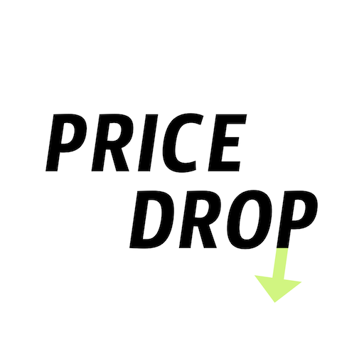
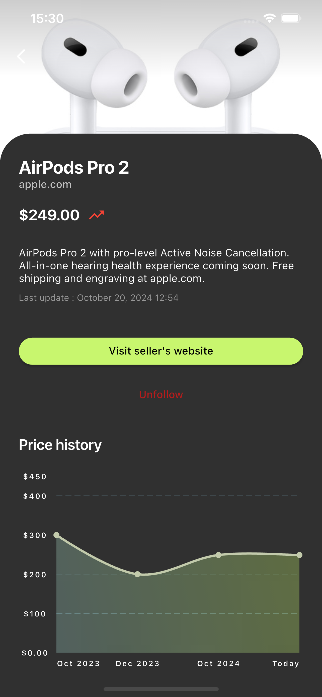

<!-- PROJECT LOGO -->

  

Never miss a great deal again with Price Drop !

[![Applestore][Applestore-free]][Applestore-url]
[![Playstore][Playstore-free]][Playstore-url]

<!-- ABOUT THE PROJECT -->

## About The Project

    

 

Track the prices of your favorite products and be the first to know when prices
drop.

**Key Features :**

- Real-time Price Tracking: Simply add a product to your list, and Price Drop
  monitors the prices for you 24/7. - Instant Notifications: Receive an
  immediate alert as soon as a price drop is detected, allowing you to buy at
  the best time.
- Multi-site Support: Price Drop works across all your favorite shopping sites,
  giving you a comprehensive view of your products, no matter where they’re
  sold.
- Price History: Check the history of price changes to better understand trends
  and make more informed purchase decisions.

**Why Choose Price Drop ?**

With Price Drop, saving money has never been easier. Whether you're planning to
buy a new electronic device or simply waiting for the best deal on a fashion
product, Price Drop helps you get the most out of your budget.

**Download Now !**

[![Applestore][Applestore]][Applestore-url]
[![Playstore][Playstore]][Playstore-url]

Join a community of savvy shoppers who save daily with Price Drop. Never miss a
price drop again!

(<a href="#readme-top">back to top</a>)

## Built With

[![Flutter][Flutter.dev]][Flutter-url]\
[![Supabase][Supabase.com]][Supabase-url]\
[![Firecrawl][Firecrawl.dev]][Firecrawl-url]\
[![Chat GPT][Chatgpt.com]][Chatgpt-url]

<!-- CONTACT -->

## Contact

https://ad-angelo.github.io/#contact

<!-- ACKNOWLEDGMENTS -->

## Privacy & Terms

[Privacy](https://ad-angelo.github.io/price-drop/en/privacy)

[Terms](https://ad-angelo.github.io/price-drop/en/terms)

<!-- MARKDOWN LINKS & IMAGES -->
<!-- https://www.markdownguide.org/basic-syntax/#reference-style-links -->

[Flutter.dev]: https://img.shields.io/badge/flutter-deepskyblue?logo=flutter&style=for-the-badge
[Flutter-url]: https://flutter.dev
[Supabase.com]: https://img.shields.io/badge/supabase-black?logo=supabase&style=for-the-badge
[Supabase-url]: https://supabase.com
[Firecrawl.dev]: https://img.shields.io/badge/🔥%20firecrawl-orange?style=for-the-badge
[Firecrawl-url]: https://www.firecrawl.dev
[Chatgpt.com]: https://img.shields.io/badge/chat%20gpt-74aa9c?logo=openai&style=for-the-badge
[Chatgpt-url]: https://chatgpt.com
[Applestore]: https://img.shields.io/badge/apple%20store-%20-dodgerblue?&logo=apple&style=for-the-badge
[Applestore-free]: https://img.shields.io/badge/apple%20store-free%20!-dodgerblue?&logo=apple&style=for-the-badge
[Applestore-url]: https://apps.apple.com/fr/app/price-drop/id6621245639
[Playstore]: https://img.shields.io/badge/play%20store-%20-springgreen?&logo=google-play&style=for-the-badge
[Playstore-free]: https://img.shields.io/badge/play%20store-free%20!-springgreen?&logo=google-play&style=for-the-badge
[Playstore-url]: https://play.google.com/store/apps/details?id=com.adangelo.priceDrop
